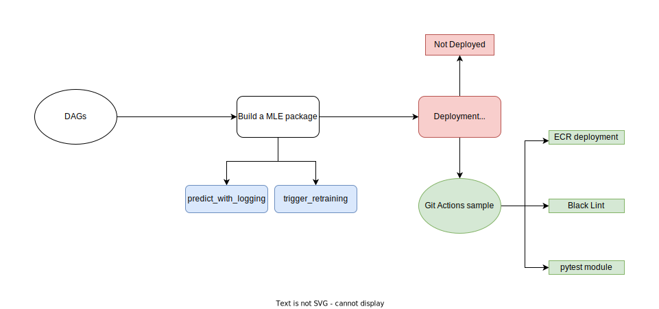

# DESCRIPTION OF THE PROJECT

## DIAGRAM

The editable diagram can be found [here](https://viewer.diagrams.net/?tags=%7B%7D&highlight=0000ff&edit=_blank&layers=1&nav=1&title=diagram.xml#R3Vlbc6MgGP01edwdxUvMY5Om7UO7s9M%2B7PapQ5QoGxQHycX%2B%2BsWIMYppbbcubWaSCRxB5HwfxwMZWbN4d81gGt3RAJERMILdyLocAWBazlj8FEheImMTlEDIcCAb1cADfkYSNCS6xgHKGg05pYTjtAn6NEmQzxsYZIxum82WlDRHTWGIFODBh0RFf%2BGARyXqOUaN3yAcRtXIpiGvxLBqLIEsggHdHkHWfGTNGKW8LMW7GSIFeRUvZb%2BrE1cPD8ZQwvt0eH5%2BZPfLdLrCs9XmauJvlvObbzI6G0jWcsLyYXleMYACQYisUsYjGtIEknmNThldJwEqhjFErW5zS2kqQFOAfxDnuYwuXHMqoIjHRF4txywGOjk3CWV0zXz0woSqHIEsRPyFdu4hAiJ1EY0RZ7noxxCBHG%2BazwFlDoWHdjXNoiCZfgPrpsL65cV1pjJPiEjzguFthDl6SOF%2B6lux0rr42yDG0e5lBtUZyw5jmaVymYIqwbd10ptVJkdHCe8ZA3E0ObfMdHtmpqczM8HZCUJf2oFWRQATHTQLMln%2Bu%2Bj%2F3amqj%2FJ2%2B8rlrlHLZU1HeLQuC1dZFdM1Fk5CDCW%2Bd7fz%2Fez9VWEm2nGso2T%2BFyW3XKcp5W5PKXeHknLTPjdR8XpmbWl2tdmMsxPz3rxrFXNPtXcoJTSPi%2FkCl4gnny6YKIVFaWRdyU87Nq9oRVNYlpiQGSWU7ftaS89Hvi%2FwjDO6QkdXFp5jO8bHaI1rtWyjfq0BCvk%2FxA4LGGUIBF2n9dl4XZ%2F1sGw3WTbHHSwbHSxbQ7EMrHNTFrO3ETkRq97Ssu96wRjMjxqkFCc8O7rzzwKoU8ADzRSwm5t9USjvWIf08Gj%2FEGVbR1BrU9qwpLVDHd6U9k8Gre934Hym%2BIw%2FY4DMiVYDpu4brnGxqi98jmmSFVOFcUrUTUPvo59mOFuvp8BBXmB3vZ48sLBcdxgTYHm6z45M9fBoPrsXQHDkw95rtrTx3H4HWGYHz2YHz2AwG6AeZE6J2AYL6BafBce2fo5VQ5vmHGWFjMQ0WHeIx9ej2TG006xKdcpQgH3%2BtMU8eiI0DHESKly%2F6XSnzTVE3rJz9%2BD6HlosP4ZrMGnJxqSnPNuDca1ukDnDYYjYExMDQJx8TabttkAPyLSo1n8dloa%2F%2FgPWmv8F)



-----
Meaning of the colors chosen:
* The `red`: task has neither been developed nor started
* The `green`: task has been done as a template
* The `blue`: task has been implemented

I will explain the `why` in the section below [below](#difficulties)

## EXTRA TASKS
### DE's tasks

create a new database user, called `analyst`, with READ and WRITE access to the public schema of the database. This user should be created when starting the database for the first time.

added to `/de/db_admin/setup_users.sql`

```
CREATE USER analyst PASSWORD 'analyst';
GRANT CREATE, USAGE ON SCHEMA public TO analyst;
```

### DS's Tasks

Add a new function to the `data_science` package to fetch the data from the sales table.

added to `ds/ds_package/src/data_science/fetch_data.py`

```
def get_sales():
    """Fetches the sales from the database
    """
    sales = pd.read_sql(
        "select * from sales",
        get_conn_string()
    )
    return sales
```

## DETAILED TIMELINE

Project/Task | Time Taken
|:-------------: | :-------------:|
Understanding on a project | 10 hours
Build a MLE Module | 3 hours
DE - Extra Task  | 10 minutes
DS - Extra Task  | 5 minutes
aws workflow    | 1 hour
black lint workflow  | 10 minutes
pytest workflow   | 40 minutes
deployment    |  4 hours
Make SOLUTION.md | 1 hour
Push on Github | 30 minutes
---
For a total of `20 hours and 35 minutes`

## DESIGN SOLUTIONS

While understanding the project , I was curious about how the DE and DS modules have been implemented. Hence in other to build the mle_package, I took a look of the ds_package , it was simple and straightfoward and I decided to reproduce the same. Moreoever, the `partial_fit()`, function that will help to retrain the model if needed was missing in the `fit()` functionality present in the ds_package

## DIFFICULTIES

* `Whole Project`

It was my first enterperise project in machine learning in a real world even if it is just a challenge. Through this I have learned a lot , way more than I thought and I figured out that I need a supervisor to guide me on my first step onto the ML architecture , as a fast learner, I believe that if I get a chance to be supervised , this kind of project could like a normal one

* `Understanding of a project`

I spent to much time to understand the project because I didn't have a clear view on what and how it can be done. I used to have 1-to-1 meeting with the supervisor to not only explain to me the outcome of the project but also to interact in cas there are queries or misunderstandings

* `Deployment`

Till now , I don't know where to start, it is actually my first deployment test, even though I am excited about that by **googling**, I don't know where to start
